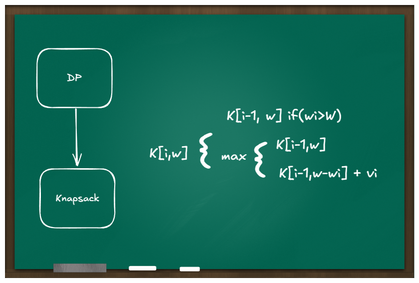

# Knapsack

## TL;DR

Knapsack(배낭) 문제는 DP 응용문제로 제한된 무게 안에서
최대 가치를 얻도록 문제를 고르는 최적화 문제

## Question

- 

  
DP란 무엇인가?

  DP(Dynamic Programming)란 점화식을 바탕으로 이전 상태의 결과를 이용하여 현재 상태를 효율적으로 계산하는 기법이다. 중복 계산을 피하기 위해 결과를 저장하며, 이전 상태가 변하지 않는다는 '최적 부분 구조' 특성을 가정한다.
  

- 

  
Knapsack 의 종류

  Knapsack 문제는 아이템을 한 번에 담을지 말지를 결정하는 0/1 Knapsack과, 아이템을 나눠서 담을 수 있는 Fractional Knapsack으로 나뉜다.
  

- 

  
일반 DP와 어떤점이 다른가?

  Knapsack 문제는 DP에서 자주 등장하는 최적화 문제 유형 중 하나로, 상태 정의와 점화식 설정이 핵심이다. 비슷한 문제로는 동전 문제(coin change)가 있으며, 이는 Unbounded Knapsack과 유사한 구조를 가진다.
  

## Rabbit hole
